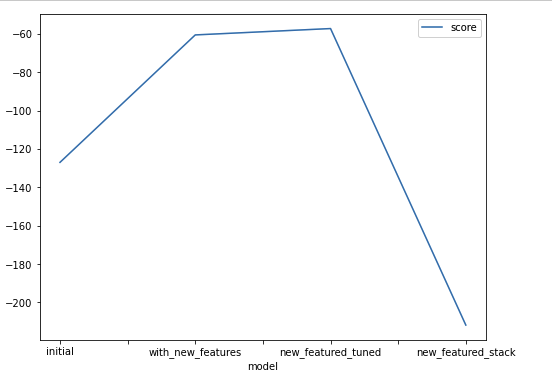
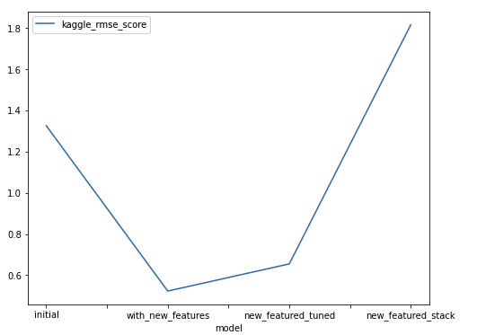

# Report: Predict Bike Sharing Demand with AutoGluon Solution

#### Muralitharan Varatharajan

## Initial Training

### What did you realize when you tried to submit your predictions? What changes were needed to the output of the predictor to submit your results?

Initial model score is `1.32` and with `'root_mean_squared_error': -129.89` - this shows that model can be improvised by feature engineering & tuning

### What was the top ranked model that performed?

got model score is `1.32` with `WeightedEnsemble_L3`

## Exploratory data analysis and feature creation

### What did the exploratory analysis find and how did you add additional features?

Added date related features like hour, year, month, weekday from the datetime feature & dropped datatime feature. And converted season, holiday, workingday and weather as category.

### How much better did your model preform after adding additional features and why do you think that is?

Updated score of `0.519` with model `WeightedEnsemble_L3`

## Hyper parameter tuning

### How much better did your model preform after trying different hyper parameters?

Tried using parameters GBM & KNN models

### If you were given more time with this dataset, where do you think you would spend more time?

Will explore more of hyper parameters and optimized better model

# Performance Report

| model        | hpo1                                                                                   | score   |
| ------------ | -------------------------------------------------------------------------------------- | ------- |
| initial      | None                                                                                   | 1.32582 |
| add_features | None                                                                                   | 0.5231  |
| hpo          | gbm with num_boost_round 100, num_leaves in range 4 to 100, KNN with neighpurs 3 to 10 | 0.65488 |
| stacking     | num_stack_levels 2, num_bag_folds 10, num_bag_sets 2                                   | 1.8161  |

### Create a line plot showing the top model score for the three (or more) training runs during the project.

### Create a line plot showing the top kaggle score for the three (or more) prediction submissions during the project.

## Summary

- we clearly see default tabular model built with new feature has better score rates compared to other models we tried.

## Next steps

- try different hyper parameter approach to see if we can beat default model
